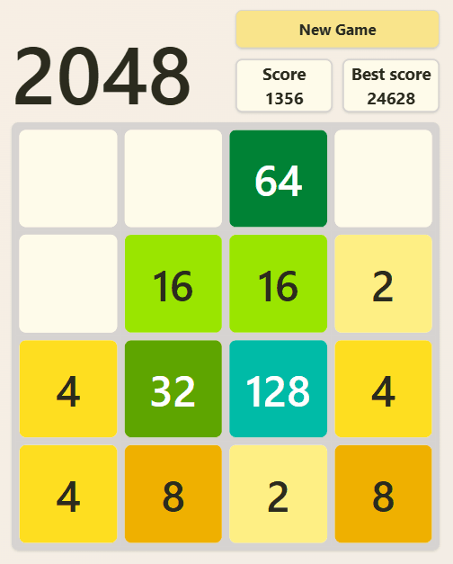
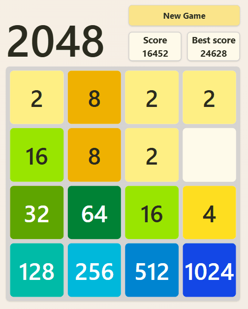

# 2048

📄 Цей README.md доступний: [**Українською 🇺🇦**](README.ua.md)

A web clone of the classic 2048 game, built with **React** & **TypeScript**.

🔗 **Live demo:** https://harynets.github.io/2048/

---

## 🛠️ Tech Stack

-   **React**
-   **TypeScript**
-   **Vite**
-   **CSS**
-   **HTML**
-   **Tailwind**

---

## 🖼️ Game Preview

### 🎮 Gameplay



### 🏆 Win State



### ❌ Game Over


---

## ✨ Features

-   🎯 Classic **2048** game mechanics
-   📱 Swipe support for mobile devices
-   🎞️ Smooth tile movement, merge and appearance animations
-   📊 Score tracking and score update animation
-   📐 Responsive layout
-   🎨 Styled with **Tailwind CSS**
-   🚀 Performance optimizations with **React.memo**
-   🔒 Type-safe logic using **TypeScript**

---

## ⚙️ Installation & Run

```bash
# Clone the repository
git clone https://github.com/Harynets/2048.git
cd 2048

# Install dependencies
npm install

# Start development server
npm run dev
```
